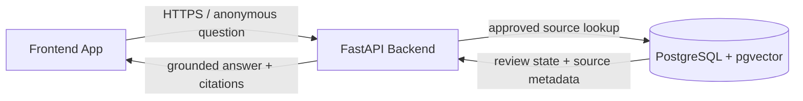
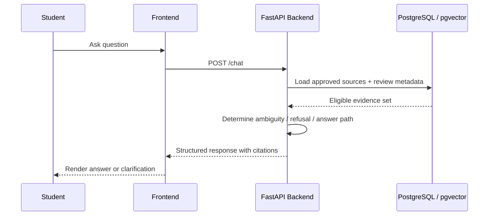

# Implementation Plan: PNW Student Information Chatbot

**Branch**: `001-pnw-student-information-chatbot` | **Date**: 2026-09-16 | **Spec**: [spec.md](spec.md)

**Input**: Feature specification from `/specs/001-pnw-student-information-chatbot/spec.md`

## Summary

Deliver an anonymous public website chat widget that answers PNW questions only from a fixed, approved corpus, cites the exact source used, asks for missing campus or term context, and fails safely when evidence is unavailable, stale, conflicting, or insufficient. The implementation uses a React widget, a FastAPI service, PostgreSQL with pgvector for governed source retrieval, and Docker Compose for pilot deployment.

## Technical Context

**Language/Version**: Python 3.12; TypeScript with React 18+

**Primary Dependencies**: FastAPI, Pydantic, SQLAlchemy, Alembic, PostgreSQL/pgvector, React, Vite, Docker Compose

**Storage**: PostgreSQL with pgvector; persistent volume for source metadata, chunks, embeddings, review state, and short-lived anonymous conversations

**Testing**: pytest for backend unit/integration/contract tests; React Testing Library for widget behavior; Playwright for end-to-end browser scenarios; fixed grounded-answer evaluation set

**Target Platform**: Linux Docker host; public HTTPS website widget embedded only on allowlisted official PNW origins

**Project Type**: Web application with React frontend and FastAPI backend

**Performance Goals**: At least 95% of pilot questions receive an initial response within 5 seconds under expected pilot usage; measure time to first validated response and complete response separately

**Constraints**: Anonymous-only pilot; no student-system access; strict origin allowlist, HTTPS, request limits, rate limiting, short conversation TTL, source approval/freshness filters, no answer without traceable citations, and refusal on conflict or insufficient evidence

**Scale/Scope**: Initial fixed corpus covering the sources listed in the spec, at least 100 supported evaluation questions plus negative and stale-source cases, and expected pilot traffic rather than campus-wide production scale

## Constitution Check

*GATE: Must pass before Phase 0 research. Re-check after Phase 1 design.*

| Gate | Status | Evidence |
|---|---|---|
| Grounded Answers | PASS | Retrieval is limited to approved, active sources with current review metadata; citations are generated from database records and validated before response. |
| Fail Safely | PASS | Missing context, low relevance, conflicts, stale/inaccessible sources, malformed model output, and timeouts produce clarification, refusal, or escalation responses. |
| Source Provenance and Review | PASS | Ingested documents are treated as reviewed for the pilot, source provenance is recorded, and scheduled review can remove a source from the approved corpus when it becomes stale or invalid. |
| Requirements Before Implementation | PASS | The clarified spec defines testable user stories, requirements, measurable outcomes, and explicit pilot scope before implementation. |
| Information Integrity | PASS | Source review records, content hashes, effective/review dates, and citation IDs are modeled and retained for traceability. |

## Project Structure

### Documentation (this feature)

```text
specs/001-pnw-student-information-chatbot/
├── plan.md
├── research.md
├── data-model.md
├── quickstart.md
├── contracts/
└── tasks.md
```

### Source Code (repository root)

```text
backend/
├── src/
│   ├── api/
│   ├── db/
│   ├── models/
│   ├── services/
│   └── main.py
├── alembic/
├── tests/
│   ├── contract/
│   ├── integration/
│   └── unit/
└── Dockerfile

frontend/
├── src/
│   ├── components/
│   ├── services/
│   └── types/
├── tests/
└── Dockerfile

contracts/
└── chat-api.md

docker-compose.yml
tests/e2e/
```

**Structure Decision**: Use separate `backend/` and `frontend/` applications with a shared feature-level `contracts/` directory. The backend owns source governance, retrieval, grounding, escalation, and persistence; the frontend owns the anonymous widget and response-state presentation. Docker Compose runs the React static server, FastAPI service, and PostgreSQL/pgvector database for the pilot. The public API contract is documented as Markdown endpoint descriptions rather than an OpenAPI YAML file.

## Architecture

### Major Components and Interactions

The pilot has two major runtime layers: the frontend application and the FastAPI backend, backed by a governed source store. The frontend app collects anonymous student input, renders the chat UI, and sends only approved request payloads to the backend. The backend validates request context, filters candidate sources, retrieves approved evidence, performs a grounded answer generation step, and returns a structured response that includes citations and escalation instructions. The database persists source records, embeddings, approval state, review dates, and conversation metadata needed to enforce the approved-corpus policy.



### Request Flow

1. A student submits a question through the embedded widget.
2. The frontend sends only the student's question to the backend API; the student does not need to provide structured campus, term, or program fields.
3. The backend normalizes the question, applies any short-lived session memory, confirms the source pool is eligible, and checks whether the question requires missing-context clarification.
4. Approved source records are filtered by relevance, freshness, effective date, campus applicability, and policy status before retrieval.
5. The backend assembles the final answer from approved evidence only, builds citations from the exact source records, and returns a structured response.
6. If evidence is missing, stale, conflicting, or out of scope, the backend returns a clarification or refusal with an escalation path instead of a speculative answer.



### Design Notes

- The backend enforces governance rules before the model sees the question, so the first decision boundary is source eligibility rather than answer generation.
- The frontend remains stateless with respect to governance; it does not decide which sources are approved or which claims are safe to answer.
- The database acts as the source-of-truth for approval, validity, and citation metadata, which allows the system to explain why an answer is allowed or rejected.

## Phase 0 Research Summary

- Use hybrid lexical/vector retrieval, starting with exact pgvector search for the small corpus and benchmarking filtered HNSW before enabling it.
- Enforce source approval, active version, review validity, and campus/term applicability in SQL before model generation.
- Return structured answer states (`answer`, `clarification`, `refusal`, `error`) with backend-built citations; never trust model-generated URLs.
- Store only a short-lived anonymous conversation context containing topic and applicable filters; redact likely personal data from logs.
- Apply strict CORS, HTTPS, request size limits, rate limiting, model timeouts, health checks, persistent database volume, migrations, and non-root containers.

## Post-Design Constitution Check

All gates remain passing. The design makes the constitution executable through database eligibility filters, a grounding validator, structured refusal paths, source review metadata, and acceptance tests for unsupported, conflicting, stale, personalized, and out-of-scope questions. Source provenance is treated as recorded at ingest time, with scheduled review and expiry still required to keep the corpus valid.

## Complexity Tracking

No constitution violations require justification. The two-application structure is required by the public widget and independently deployable API boundary; PostgreSQL/pgvector is selected to keep source governance and retrieval in one transactional pilot store.
